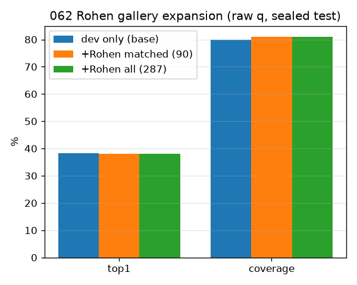

# 062 / M-rohen0 STEP-1d — Rohen gallery-expansion effect (RAW q, cheap probe)

- 날짜: 2026-06-28 · 커밋 `main @ f6da0bd` · `scripts/rohen_effect.py`
- 사용자 합의 순서: **raw q로 Δtop1 먼저** → 효과 입증 시 손수 정제(틀린 q 제거) → 재측정.
- 287 후보를 vitb14 global+L256로 임베딩, 라벨 정규화 매칭(90 매칭), dev gallery에 추가, sealed test(CSLS).

## 결과 (sealed test, RAW q)
| gallery | top1 | Δ | coverage | Δ |
|---|---|---|---|---|
| dev only (baseline) | 38.3 | — | 79.8 | — |
| + Rohen matched-only (90) | 38.1 | -0.2 | 81.0 | +1.2 |
| + Rohen all (287) | 38.1 | -0.2 | 81.0 | +1.2 |

## 판정
🟡 raw q로는 약함 — q 노이즈/라벨 매칭이 효과를 누르거나, 신규구조 위주. 검증 정제 후 재측정 가치.

## 다음
- 검증 정제 후 재측정 (raw q 노이즈 제거 시 효과 드러날 수 있음).
